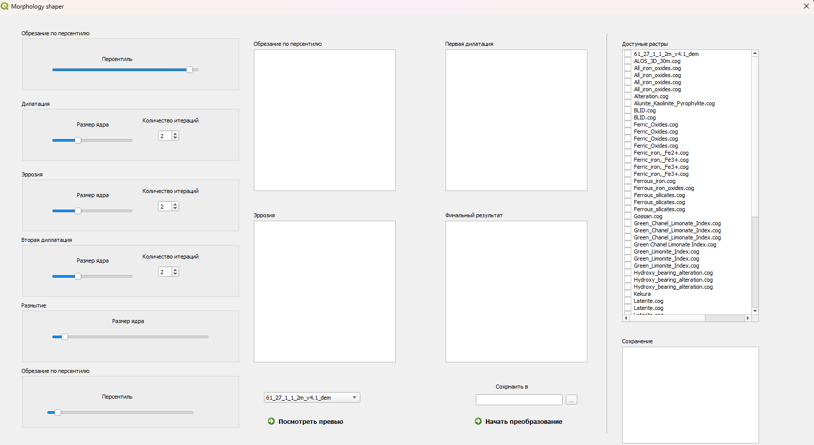

# Morphology-shaper

Qgis-плагин для генерации .shp файлов с анмаолиями из растровых файлов.

# Installation

Нужно скопировать все файлы проекта в 

C:\Users\ИМЯ_ПОЛЬЗОВАТЕЛЯ\AppData\Roaming\QGIS\QGIS3\profiles\default\python\plugins

После чего на панели планигинов в Qgis появится значок плагина.

# Quick-start

Выделение контуров аномлий просиходит за счёт последовательных морфологических преобразований над растром, за счет чего можно добиться желаемой формы аномалий.

1. Выделение бинарной маски по пресентилю
2. Дилация 
3. Эррозия
4. Вторая дилация
5. Гауссово размытие
5. Обрезание по пресентилю

Чтобы сохранить итоговый .shp-файл нужно начать кнопку начать преборазование и выбрать расположение файла, куда сохранится файл.